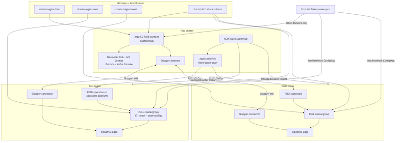
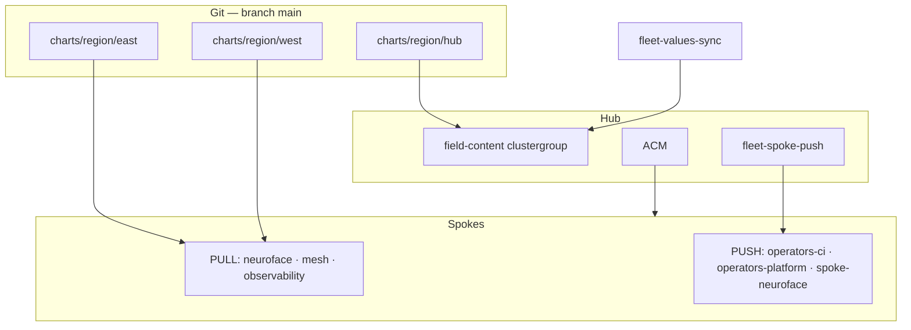

# Hybrid Mesh Platform

[](https://maximilianopizarro.github.io/hybrid-mesh-platform/)
[](https://validatedpatterns.io)

Validated Patterns implementation of the Hybrid Mesh hub-spoke platform (forked from [multicloud-gitops](https://github.com/validatedpatterns/multicloud-gitops)).

**Documentation:** [maximilianopizarro.github.io/hybrid-mesh-platform](https://maximilianopizarro.github.io/hybrid-mesh-platform/)  
**Workshop Showroom:** [showroom-hybrid-mesh-ai](https://github.com/maximilianoPizarro/showroom-hybrid-mesh-ai) · [Workshop guide (GitHub Pages)](docs/validatedpatterns-docs/workshop/index.md)

## Why this pattern?

Enterprise teams need **secure multi-cluster connectivity**, **centralized GitOps**, and **edge + AI workloads** on OpenShift — without maintaining three independent control planes or site-to-site VPNs for every demo.

Hybrid Mesh Platform combines:

- **Hub-spoke fleet management** (ACM) with dual GitOps (PUSH ApplicationSet + PULL clustergroup per spoke)
- **Cross-cluster service connectivity** (Skupper VAN) so the hub reaches spoke Kafka, metrics, NeuroFace gateways, and CV inference privately
- **AI Computer Vision at the Edge** — NeuroFace full stack on east/west spokes (OVMS ModelMesh face detection, YOLO PPE, Kafka, Grafana), federated 50/50 from hub Gateway API
- **Industrial Edge** factory telemetry (MQTT → Kafka → ML → dashboards) — **optional, disabled by default** on spokes
- **Centralized security and observability** (ACS Central, Grafana, Kafka Console on the hub)
- **Developer experience** (Developer Hub templates incl. `ai-computer-vision`, OpenShift AI / MaaS, Gateway API ingress via RHCL/Kuadrant)

See the [NeuroFace & CV journey](docs/validatedpatterns-docs/products/neuroface.md) for the primary demo path, or [architecture overview](docs/validatedpatterns-docs/architecture.md) for hub→spoke diagrams.

## Architecture at a glance

One **Validated Patterns** repo (`main`), three **region paths**, **dual GitOps** on spokes (PUSH + PULL), **ACM** fleet, **Skupper** mesh.





| Topic | Doc |
|-------|-----|
| Full architecture | [architecture.md](docs/validatedpatterns-docs/architecture.md) |
| PUSH vs PULL | [gitops-push-vs-pull.md](docs/validatedpatterns-docs/gitops-push-vs-pull.md) |
| Domain sync | [fleet-values-sync.md](docs/validatedpatterns-docs/fleet-values-sync.md) |
| Regions / `main` | [REGIONS.md](REGIONS.md) |

## What's included

| Component | What it does for you |
| --------- | -------------------- |
| **ACM + dual GitOps** | Fleet inventory, placement, PUSH operators + PULL neuroface/mesh per spoke |
| **Skupper** | Private TCP bridge hub ↔ spokes (NeuroFace gateways, Kafka, Grafana datasources) |
| **RHCL / Kuadrant** | Gateway API ingress with optional rate limits and API keys |
| **NeuroFace / AI CV** | Full app + PPE inference on spokes; hub `neuroface-gateway` 50/50 routing |
| **Industrial Edge** *(optional)* | MQTT, Camel K, Kafka, Tekton CI, line-dashboard — enable in region values |
| **OpenShift AI + MaaS** | Hub workbenches, ModelMesh/OVMS on spokes, external LLM via RHDP LiteMaaS |
| **ACS** | Central vulnerability and runtime policy across hub + spokes |
| **Developer Hub** | Catalog, scaffolding, multi-cluster topology, Tekton visibility |

Technical detail: 50+ Helm charts, decoupled Argo AppProjects (`operators-platform`, `industrial-edge`, `mesh`, `workshop`, `security`, …), ambient Service Mesh.

## Quick start

### Prerequisites

- OpenShift **4.14+** (hub + two spokes recommended; see [Cluster sizing](#cluster-sizing))
- **`oc`** logged in as **cluster-admin** on the hub
- **Helm 3** and Git
- **RHDP workshop:** three separate catalog orders (hub, east, west) — see [RHDP field content](docs/validatedpatterns-docs/rhdp-field-content.md) and the [RHDP install playbook](docs/validatedpatterns-docs/install-improvements.md). Allow **60–90 minutes** for full fleet sync and console links to converge.
- **Day-2:** automatic via Argo app `hub-post-install-bootstrap` (PostSync Jobs, sync wave 9) — [playbook](docs/validatedpatterns-docs/install-improvements.md#post-install-day-2-gitops-postsync-jobs)
- **Standalone:** fork this repo, copy secrets template, run install below on the hub only; import spokes via ACM

```bash
# Clone and configure
git clone https://github.com/maximilianoPizarro/hybrid-mesh-platform.git
cd hybrid-mesh-platform
cp values-secret.yaml.template values-secret.yaml
# Edit values-secret.yaml — see docs/validatedpatterns-docs/secrets-configuration.md

# Install on hub cluster (bootstraps clustergroup + ACM ApplicationSet)
./pattern.sh make install
```

After install: register east/west in ACM, verify ApplicationSet `fleet-spoke-push`, then follow [Getting Started](docs/validatedpatterns-docs/getting-started.md).

## Repository structure

```
hybrid-mesh-platform/
├── charts/
│   ├── region/           # Bootstrap per cluster role
│   │   ├── hub/          # Hub (ACM, RHDH, ACS Central)
│   │   ├── east/         # East spoke (IE, ACS Secured)
│   │   └── west/         # West spoke (IE, ACS Secured)
│   └── all/              # 50+ shared Helm charts
├── docs/                 # GitHub Pages documentation
├── overrides/            # Platform-specific values
├── scripts/              # Utility scripts
├── values-global.yaml    # Pattern-wide globals
└── pattern.sh            # VP framework bootstrap
```

## Region strategy (single branch: `main`)

| Cluster | Bootstrap Path | Description |
|---------|----------------|-------------|
| **Hub** | `charts/region/hub` | ACM, Developer Hub, ACS Central, GitLab, neuroface-gateway |
| **East** | `charts/region/east` | NeuroFace/CV (default), ACS Secured, Skupper |
| **West** | `charts/region/west` | NeuroFace/CV (default), ACS Secured, Skupper |

See [Region Strategy](docs/validatedpatterns-docs/region-strategy.md) for details.

## Cluster sizing

Sizing reflects **v2.2 AI CV at the Edge** (NeuroFace + OVMS ModelMesh + KServe YOLO on spokes). Industrial Edge is **optional** and off by default. Hub runs GitOps and platform services only — inference runs on spokes.

### Hub (CPU-only)

| Tier | Workers | vCPU / worker | Memory / worker | Total alloc | Use case |
|------|---------|---------------|-----------------|-------------|----------|
| **Recommended (workshop 30–50)** | **4** | **16** | **64 GiB** | 64 vCPU / 256 GiB | Full stack: GitLab, Developer Hub, OpenShift AI 3.4, Kubecost, Quay, CNV, Kuadrant, Lightspeed, ACS |
| Minimum demo (1–5 users) | 3 | 8 | 32 GiB | 24 vCPU / 96 GiB | Tight; disable Kubecost/CNV or expect Evicted pods under load |

**Notes:** On RHDP, control-plane nodes are schedulable and carry ~50% of memory (kube-apiserver, etcd, monitoring). GitLab alone uses ~20 GiB steady state. Kubecost adds ~14 GiB — disable on minimum-demo tiers.

### Spokes — CPU-only (default)

All inference on CPU: OVMS `openvino_ir` face-detection, KServe YOLO PPE `best.pt`.

| Tier | Workers | vCPU / worker | Memory / worker | Total alloc | Use case |
|------|---------|---------------|-----------------|-------------|----------|
| **Recommended (AI CV + DevSpaces)** | **3** | **8** | **32 GiB** | 24 vCPU / 96 GiB | NeuroFace + OVMS ModelMesh + YOLO PPE + DevSpaces + Kafka + Skupper |
| Minimum demo (AI CV only) | 2 | 4 | 16 GiB | 8 vCPU / 32 GiB | NeuroFace + OVMS only; no DevSpaces; tight on KServe cold starts |

### Spokes — GPU-accelerated (optional)

For faster OVMS/YOLO throughput or self-hosted LLM (vLLM). Requires **NFD** + **NVIDIA GPU Operator** on the spoke (not in pattern by default).

| Tier | Workers | vCPU / worker | Memory / worker | GPU / worker | Total GPU | Use case |
|------|---------|---------------|-----------------|--------------|-----------|----------|
| Recommended (inference + DevSpaces) | 3 | 8 | 32 GiB | 1× T4 / A10G | 3 | OVMS GPU, YOLO GPU, local vLLM 7B, DevSpaces |
| Production-like (multi-model) | 3 | 16 | 64 GiB | 1× A100 / A10G (24+ GB VRAM) | 3 | Multiple InferenceServices, self-hosted LLM 14–70B |

Set `resources.limits.nvidia.com/gpu: "1"` on InferenceService predictors when GPU nodes are available.

### GPU operators (install before AI workloads on GPU nodes)

| Operator | Channel | Catalog | Install on |
|----------|---------|---------|------------|
| **Node Feature Discovery (NFD)** | stable | redhat-operators | Spokes (or hub) with GPU nodes |
| **NVIDIA GPU Operator** | stable | certified-operators | Spokes with GPU nodes |

Optional: **NVIDIA Network Operator** (distributed training), **OpenShift Serverless** (Knative KServe scale-to-zero), **NVIDIA NIM Operator** (enterprise LLM).

**Cloud examples:** AWS `g4dn.xlarge` (T4), `g5.2xlarge` (A10G + vLLM 7B); Azure `Standard_NC4as_T4_v3`; GCP `a2-highgpu-1g` (A100).

See [Bill of Materials — Cluster sizing](docs/bill-of-materials.md#cluster-sizing) and [OpenShift AI — GPU inference](docs/validatedpatterns-docs/products/openshift-ai.md#gpu-inference-optional).

Verify capacity after cluster provision:

```bash
bash scripts/verify-node-capacity.sh
WORKSHOP_USERS=50 bash scripts/verify-node-capacity.sh
ROLE=spoke bash scripts/verify-node-capacity.sh
SPOKE_TIER=minimum ROLE=spoke bash scripts/verify-node-capacity.sh
CHECK_GPU=1 ROLE=spoke bash scripts/verify-node-capacity.sh
```

## Verification

Prove the **product surfaces** — not only that Argo CD apps exist:

```bash
# Hub: log in so OAuth-protected links (OpenShift AI) get a bearer token
oc login --token=<token> --server=<hub-api-url>

# Console menu links — expect 19–20 OK on a full hub install (IE link may 503 when disabled)
MIN_OK_CODE=200 bash scripts/verify-console-links.sh

# AI CV surfaces (NeuroFace app + PPE gateway)
bash scripts/verify-neuroface-cv.sh

# Workshop HTTP smoke (skips IE when hub-gateway not deployed)
bash scripts/verify-workshop-http200.sh

# Industrial Edge — only when IE enabled (set VERIFY_IE=1)
bash scripts/verify-industrial-edge.sh

# Fleet inventory + Skupper + ApplicationSet
bash scripts/verify-fleet.sh

# Offline GitOps checks
bash scripts/argocd-preflight.sh
python scripts/verify-gitops-strategies.py
```

See [Validation Guide](docs/validation-guide.md) for the full component matrix and [hub console links checklist](docs/validation-guide.md#hub-console-links-19-expected).

## Workshop Showroom

Hub-resident Antora lab (`showroom`, `workshop-registration`, `workshop-demos` charts). Learners register → `https://showroom-showroom.apps.<hub-domain>/` with per-user `USER_NAME`.

| Task | Command |
| ---- | ------- |
| Sync hero PNGs to showroom repo | `SHOWROOM_DIR=../showroom-hybrid-mesh-ai bash scripts/sync-showroom-content.sh` |
| Screenshot manifest (live hub URLs) | `scripts/workshop-screenshot-manifest.yaml` |
| Batch capture | `node scripts/capture-workshop-screenshots.mjs` |
| Verify routes | `bash scripts/verify-workshop-http200.sh` |
| Rollout after content push | `oc rollout restart deployment/showroom -n showroom` |

Hero images are **live cluster captures** in `docs/assets/images/workshop/` (ACS heroes `03`/`20` preserved). Full maintainer guide: [Workshop docs](docs/validatedpatterns-docs/workshop/index.md).

## Documentation

| Topic | Link |
|-------|------|
| **Architecture** | [docs/validatedpatterns-docs/architecture.md](docs/validatedpatterns-docs/architecture.md) |
| **Getting Started** | [docs/validatedpatterns-docs/getting-started.md](docs/validatedpatterns-docs/getting-started.md) |
| **RHDP install playbook** | [docs/validatedpatterns-docs/install-improvements.md](docs/validatedpatterns-docs/install-improvements.md) |
| **Bill of Materials** | [docs/bill-of-materials.md](docs/bill-of-materials.md) |
| **Validation Guide** | [docs/validation-guide.md](docs/validation-guide.md) |
| **GitOps Strategy** | [docs/validatedpatterns-docs/gitops-push-vs-pull.md](docs/validatedpatterns-docs/gitops-push-vs-pull.md) |
| **Fleet domain sync** | [docs/validatedpatterns-docs/fleet-values-sync.md](docs/validatedpatterns-docs/fleet-values-sync.md) |
| **Secrets config** | [docs/validatedpatterns-docs/secrets-configuration.md](docs/validatedpatterns-docs/secrets-configuration.md) |
| **Deployment chain** | [docs/validatedpatterns-docs/gitops-deployment-chain.md](docs/validatedpatterns-docs/gitops-deployment-chain.md) |
| **Products Index** | [docs/validatedpatterns-docs/products/index.md](docs/validatedpatterns-docs/products/index.md) |
| **Troubleshooting** | [docs/validatedpatterns-docs/troubleshooting.md](docs/validatedpatterns-docs/troubleshooting.md) |
| **Workshop Showroom** | [docs/validatedpatterns-docs/workshop/index.md](docs/validatedpatterns-docs/workshop/index.md) |

## Support

This is a **Sandbox tier** Validated Pattern with community best-effort support.

See [SUPPORT.md](SUPPORT.md) for details.

## License

Apache License 2.0
