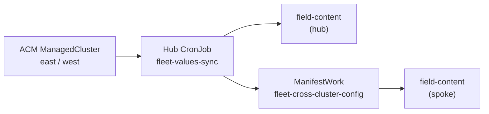

# Fleet values sync

Chart **`fleet-values-sync`** (`charts/all/fleet-values-sync`) keeps **cross-cluster domain references** in the `field-content` Argo CD Application aligned with ACM inventory — without committing cluster-specific URLs to Git.

It is part of the [Validated Patterns](https://validatedpatterns.io) clustergroup on hub and spokes. See also [GitOps PUSH vs PULL](gitops-push-vs-pull.md) and [Region strategy](region-strategy.md).

## What it does

| Mode | Cluster | Action |
|------|---------|--------|
| **Hub** | Hub | Reads `ManagedCluster` east/west + local ingress; patches hub `field-content` with `deployer.domain`, `clusters.hub|east|west.domain`, and API URLs |
| **Hub** | Hub | Pushes `fleet-cross-cluster-config` ConfigMap to spokes via ACM **ManifestWork** |
| **Spoke** | East / West | Reads ConfigMap; patches local `field-content` with `clusters.hub.domain` and `global.hubClusterDomain` |

**What it does not do:** import spoke API tokens, create `ManagedCluster` objects, or patch secrets. Tokens belong in one-time ACM import or RHDP secrets — see [RHDP install playbook](install-improvements.md).

## When it runs

- **CronJob** `fleet-values-sync` in namespace `openshift-gitops` (deployed by clustergroup)
- Default schedule: every **10 minutes**
- Idempotent: skips patch when helm values already match

## Data flow



Downstream charts consume patched values via clustergroup `extraParametersNested` — for example `clusters.east.domain` for Kafka Console, Skupper, Developer Hub topology, and console links.

## Prerequisites

1. Hub `field-content` Application exists and syncs.
2. East and west clusters are **imported in ACM** and show **Available**.
3. `ManagedCluster` status includes API URL (ACM 2.16+: `apiserverurl.openshift.io` claim).

Until spokes are Available, the job logs `ManagedCluster east not found yet` and retries on the next CronJob tick.

## Verify

```bash
# CronJob deployed
oc get cronjob fleet-values-sync -n openshift-gitops

# Manual run (hub)
oc delete job fleet-values-sync-manual -n openshift-gitops --ignore-not-found
oc create job fleet-values-sync-manual --from=cronjob/fleet-values-sync -n openshift-gitops
oc logs -n openshift-gitops job/fleet-values-sync-manual -f

# Domains in field-content
oc get application field-content -n openshift-gitops -o jsonpath='{.spec.source.helm.valuesObject.clusters}{"\n"}' | python3 -m json.tool

# Spoke received hub domain
oc get configmap fleet-cross-cluster-config -n openshift-gitops -o yaml
```

Also covered by `bash scripts/verify-fleet.sh` (checks CronJob presence).

## Troubleshooting

| Symptom | Likely cause | Fix |
|---------|--------------|-----|
| Stale `clusters.east.domain` on hub | Spoke not **Available** when job last ran | Wait for ACM import; run manual job |
| Spoke missing `clusters.hub.domain` | ManifestWork not applied or spoke CronJob missing | Sync `fleet-values-sync` on spoke; check `oc get manifestworks -n open-cluster-management` |
| Wrong apps domain after ACM 2.16 upgrade | Old job read `kube-apiserver` claim only | Use chart ≥ fix for `apiserverurl.openshift.io` (included in this repo) |
| Kafka Console / Skupper still point at `example.com` | `field-content` not patched yet | Confirm `deployer.domain` overridden by RHDP or fleet-values-sync; refresh affected Argo apps |
| You patched tokens into `field-content` | Anti-pattern | Remove tokens from GitOps values; use ACM UI import — see [troubleshooting](troubleshooting.md) |

## Related

- [Architecture](architecture.md) — hub-spoke overview
- [RHDP field content](rhdp-field-content.md) — RHDP injects `deployer.domain` before fleet-values-sync runs
- [GitOps deployment chain](gitops-deployment-chain.md) — where `field-content` sits in the chain
