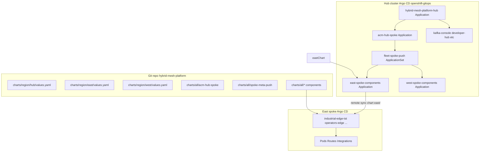

# GitOps deployment chain (hub → spokes)

This page explains **why** you see names like `acm-hub-spoke`, `east-spoke-components`, and `industrial-edge-tst` in ACM / Argo CD, and **which YAML** creates each link.

{: .note }
> **ACM Fleet → Applications** lists **Argo CD `Application`** resources. The **ApplicationSet** `fleet-spoke-push` is a separate object. Search for it under **Infrastructure → Clusters → GitOps** (Argo CD UI) or with `oc get applicationset fleet-spoke-push -n openshift-gitops`.

## End-to-end diagram



## Layer 1 — Hub bootstrap (region chart)

**What you run once on the hub** (standalone or via RHDP field-content):

```bash
# Standalone — requires oc logged in as cluster-admin
./pattern.sh make install

# RHDP — three catalog orders; hub path charts/region/hub
# deployer.domain injected by Argo CD helm values (see rhdp-field-content.md)
```

**What it renders:** the `charts/region/hub` chart creates a **multi-source** Argo CD `Application` that pulls the VP **`clustergroup`** chart plus `charts/region/hub/values.yaml`:

[`charts/region/hub/templates/clustergroup-application.yaml`](../../charts/region/hub/templates/clustergroup-application.yaml):

```yaml
apiVersion: argoproj.io/v1alpha1
kind: Application
metadata:
  name: hybrid-mesh-platform-hub    # {{ pattern }}-{{ clusterGroupName }}
  namespace: openshift-gitops
spec:
  sources:
    - repoURL: https://github.com/.../hybrid-mesh-platform
      ref: patternref
    - repoURL: https://charts.validatedpatterns.io
      chart: clustergroup
      helm:
        valueFiles:
          - $patternref/values-global.yaml
          - $patternref/charts/region/hub/values.yaml
```

The **clustergroup** chart loops `clusterGroup.applications` in [`charts/region/hub/values.yaml`](../../charts/region/hub/values.yaml) and creates one child `Application` per entry — including **`acm-hub-spoke`**, **`developer-hub`**, **`service-interconnect`**, etc.

Entry for ACM:

```yaml
clusterGroup:
  applications:
    acm-hub-spoke:
      name: acm-hub-spoke
      namespace: openshift-gitops
      argoProject: fleet
      path: charts/all/acm-hub-spoke
      syncWave: '6'
```

**ACM UI / Argo CD:** `acm-hub-spoke` on **local-cluster** — parent of the fleet **ApplicationSet**, not the ApplicationSet itself.

---

## Layer 2 — ACM + ApplicationSet (`charts/all/acm-hub-spoke`)

When `acm-hub-spoke` syncs, it applies **Placement**, **GitOpsCluster**, **ConfigMap `acm-placement`**, and the **ApplicationSet** (sync waves 1–4).

### 2a — Placement selects east and west

[`charts/all/acm-hub-spoke/templates/placement.yaml`](../charts/all/acm-hub-spoke/templates/placement.yaml):

```yaml
apiVersion: cluster.open-cluster-management.io/v1beta1
kind: Placement
metadata:
  name: hub-spoke-placement
  namespace: openshift-gitops
  labels:
    cluster.open-cluster-management.io/placement: hub-spoke-placement
spec:
  clusterSets:
    - global
  predicates:
    - requiredClusterSelector:
        labelSelector:
          matchExpressions:
            - key: region
              operator: In
              values: [east, west]
```

ACM creates **PlacementDecision** objects listing cluster names (`east`, `west`).

### 2b — ConfigMap tells the generator how to read decisions

[`charts/all/acm-hub-spoke/templates/acm-placement-configmap.yaml`](../charts/all/acm-hub-spoke/templates/acm-placement-configmap.yaml):

```yaml
apiVersion: v1
kind: ConfigMap
metadata:
  name: acm-placement
  namespace: openshift-gitops
data:
  apiVersion: cluster.open-cluster-management.io/v1beta1
  kind: placementdecisions
  matchKey: clusterName
  statusListKey: decisions
```

### 2c — ApplicationSet (fleet root for spokes)

[`charts/all/acm-hub-spoke/templates/applicationset.yaml`](../charts/all/acm-hub-spoke/templates/applicationset.yaml):

```yaml
apiVersion: argoproj.io/v1alpha1
kind: ApplicationSet
metadata:
  name: fleet-spoke-push          # <-- search this name in CLI / Argo CD
  namespace: openshift-gitops
  labels:
    cluster.open-cluster-management.io/placement: hub-spoke-placement
spec:
  generators:
    - clusterDecisionResource:
        configMapRef: acm-placement
        labelSelector:
          matchLabels:
            cluster.open-cluster-management.io/placement: hub-spoke-placement
  template:
    metadata:
      name: '{{name}}-spoke-components'   # east-spoke-components, west-spoke-components
    spec:
      source:
        repoURL: https://github.com/.../hybrid-mesh-platform
        path: '{{name}}'                    # east/  or  west/
      destination:
        name: '{{name}}'                    # Argo CD cluster secret: east | west
        namespace: openshift-gitops
      syncPolicy:
        automated:
          selfHeal: true
          prune: true
```

| Generator variable | Becomes in template |
| ------------------ | ------------------- |
| `{{name}}` | `east` / `west` — folder and Argo cluster name |
| (from PlacementDecision) | One `Application` per selected cluster |

**Important:** This ApplicationSet is a **normal** manifest (sync-wave `4`), not a PostSync hook, so it **stays** in the cluster and ACM can index it.

---

## Layer 3 — Spoke GitOps (PULL + PUSH)

**PUSH (hub → spoke):** `east-spoke-components` / `west-spoke-components` (on **hub** Argo CD, destination **east** / **west**) sync [`charts/all/spoke-meta-push`](../../charts/all/spoke-meta-push/). That chart loops `components[]` and creates child Applications on the spoke (e.g. `operators-ci-east`).

**PULL (spoke local):** Each spoke runs RHDP field-content at `charts/region/east` or `charts/region/west`, which deploys **clustergroup** from [`charts/region/east/values.yaml`](../../charts/region/east/values.yaml) (or west). Child apps point at `charts/all/*`:

```yaml
# excerpt from charts/region/east/values.yaml → clusterGroup.applications
industrial-edge-tst:
  name: industrial-edge-tst
  path: charts/all/industrial-edge-tst
  namespace: industrial-edge-tst-all
  argoProject: industrial-edge
```

Example on **east** spoke Argo CD: `industrial-edge-tst`, `operators-edge`, `spoke-gateway`, … — names from `clusterGroup.applications`, not `-east` suffix (unless the app `name` field includes it).

---

## Layer 4 — Workloads (`charts/all/*`)

Each child `Application` points at a Helm chart under `charts/all/<name>/` (Kafka, Camel K, gateways, etc.).

---

## Naming cheat sheet

| Name you see | Kind | Where it runs | Created by |
| ------------ | ---- | ------------- | ---------- |
| `hybrid-mesh-platform-hub` | Application (clustergroup root) | Hub | `charts/region/hub` bootstrap |
| `acm-hub-spoke` | Application | Hub | `charts/region/hub/values.yaml` |
| `fleet-spoke-push` | **ApplicationSet** | Hub | `charts/all/acm-hub-spoke` |
| `east-spoke-components` | Application | Hub → deploys to east | ApplicationSet template (PUSH) |
| `industrial-edge-tst` | Application | East spoke | `charts/region/east/values.yaml` (PULL) |
| `kafka-console` | Application | Hub | `charts/region/hub/values.yaml` |

---

## Sync order (hub ACM chart)

| Wave | Resource |
| ---- | -------- |
| 0 | RBAC for ApplicationSet controller |
| 1 | ManagedClusterSet binding |
| 2 | Placement + **acm-placement** ConfigMap |
| 3 | GitOpsCluster |
| 4 | **ApplicationSet `fleet-spoke-push`** |

Spoke sync waves are defined in `charts/region/east|west/values.yaml` (`syncWave` per app). See [Architecture — Spoke sync-wave reference](architecture.md#spoke-sync-wave-reference).

---

## Verify the chain

```bash
# Hub — ApplicationSet must exist (not only child Applications)
oc config use-context hub
oc get applicationset fleet-spoke-push -n openshift-gitops
oc get placementdecisions -n openshift-gitops -l cluster.open-cluster-management.io/placement=hub-spoke-placement
oc get applications -n openshift-gitops | grep spoke-components

# East — child apps from east/ chart
oc config use-context east
oc get applications -n openshift-gitops | grep -E 'east$|east '
```

After changing `charts/all/acm-hub-spoke`:

```bash
oc annotate application acm-hub-spoke -n openshift-gitops \
  argocd.argoproj.io/refresh=hard --overwrite
```

---

## Related docs

- [Deploy with ACM and GitOps](deploy-acm-gitops.md)
- [Getting Started](getting-started.md)
- [Troubleshooting — ApplicationSet](troubleshooting.md#applicationset-both-name-and-server-defined)
