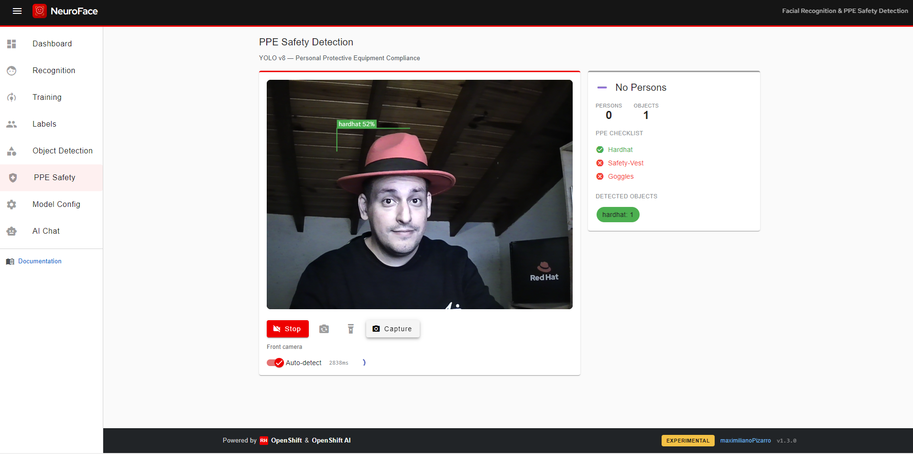

# NeuroFace

## What problem does it solve?

Workshop participants need a **multimodal AI demo** (webcam + LLM chat + PPE detection) without deploying a full custom vision pipeline. **NeuroFace** combines browser-based face analysis, **YOLO PPE serving** (hardhat, safety vest, goggles), and **MaaS** (`llama-scout-17b`) for contextual responses — one Route on the hub, integrated into Developer Hub and the Hybrid Mesh AI Workshop.



| Item | Location |
|------|----------|
| Helm wrapper | `charts/all/neuroface/` |
| Upstream chart | [maximilianoPizarro/neuroface](https://github.com/maximilianoPizarro/neuroface) **v1.3.0** |
| YOLO PPE serving | In-cluster `yolo-ppe-serving` (CPU torch, HuggingFace model) |
| PPE Workbench | OpenShift AI `Notebook` **ppe-workbench** + route `ppe-workbench.<hub-domain>` |
| Route | `https://neuroface.<hub-domain>` |
| Developer Hub | Component `demo-neuroface` in System `hybrid-mesh-shared-demos` |
| Showroom module | Parte B module 25 |

**Not LibreChat:** workshop chat multimodal UX is NeuroFace only.

## GitOps automation (fresh install)

| PostSync / chart | Purpose |
| ---------------- | ------- |
| `yolo-ppe-serving` | YOLO model download + FastAPI on port 8080 (`replicas: 1`) |
| `ppe-workbench` | Jupyter Notebook CR + `ppe-detection.ipynb` for image PPE lab |
| `neuroface-maas-key-sync` | Wires `NEUROFACE_CHAT_API_KEY` from `neuroface-maas-api-key`; copies from `kairos-ai-credentials` if placeholder |
| RHDP `litemaas.apiKey` | Clustergroup propagates key to `neuroface.chat.apiKey` (preferred on RHDP) |

## MaaS API keys

Preferred: **Vault + ExternalSecret** — see [Vault & External Secrets](vault.md).

RHDP: inject `litemaas.apiKey` in field-content / clustergroup values.

Day-2 fallback:

```bash
export MAAS_KEY_LLAMA='sk-...'
oc create secret generic maas-facilitator-seed -n vault --from-literal=api-key='sk-...'
```

## Verify

```bash
curl -sk "https://neuroface.<hub-domain>/api/ppe/status"    # reachable: true
curl -sk "https://ppe-workbench.<hub-domain>/"              # 200 when notebook pod running
oc get deploy yolo-ppe-serving -n neuroface                # READY 1/1
curl -sk -X POST "https://neuroface.<hub-domain>/api/chat" \
  -H 'Content-Type: application/json' -d '{"message":"hello"}'
```

## Troubleshooting

| Symptom | Fix |
| ------- | --- |
| PPE not enabled | Chart `neuroface.ppe.enabled: true`; check `yolo-ppe-serving` pod **replicas: 1** |
| PPE status unreachable | Scale `yolo-ppe-serving` to 1; wait ~3–5 min for pip + model load |
| Workbench 503 | Start **ppe-workbench** in OpenShift AI → Workbenches |
| Chat **401** | `maas-facilitator-seed` or RHDP `litemaas.apiKey`; PostSync `neuroface-maas-key-sync` |
| Backend CrashLoop | Orphan deploy in `default` — use namespace `neuroface` only |
| PVC Multi-Attach | Scale backend `0→1`: `oc scale deploy/neuroface-backend -n neuroface --replicas=0 && sleep 10 && oc scale --replicas=1` |

Workshop content: [Hybrid Mesh AI Workshop](../workshop/index.md).

**Related:** [OpenShift AI](openshift-ai.md) · [Vault](vault.md)
