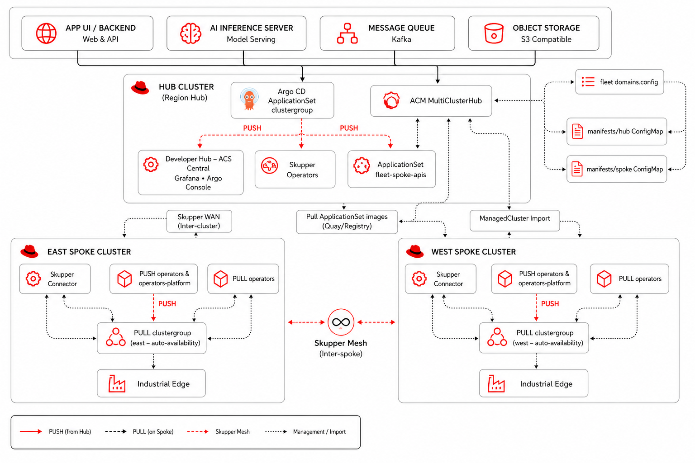
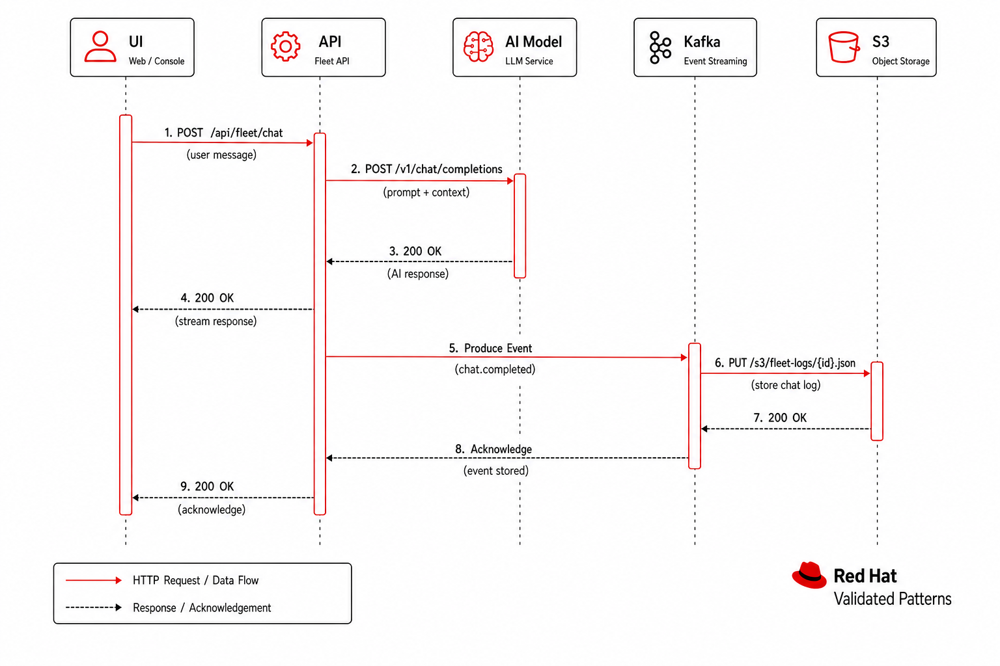
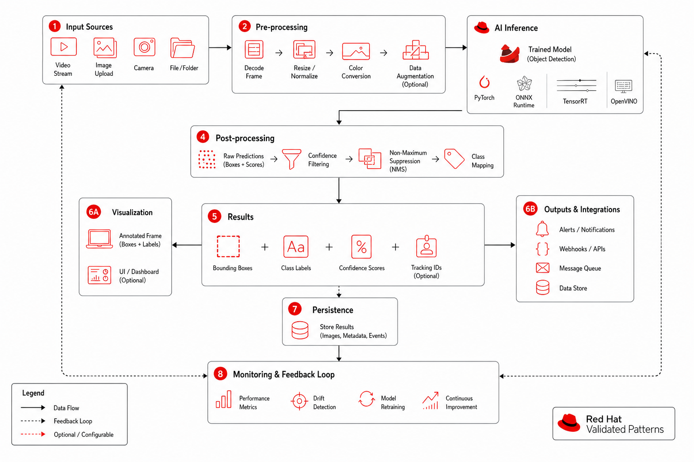

# AI Computer Vision at the Edge

**NeuroFace** is the reference application for the **AI Computer Vision at the Edge** Validated Pattern — a full-stack demo of hybrid multi-cluster computer vision using Red Hat middleware (KServe, Kafka, Skupper, Camel K, MaaS, Developer Hub, DevSpaces, OpenTelemetry, Grafana, Kubecost).

## What problem does it solve?

Workshop participants need a **multimodal AI demo** (webcam + LLM chat + PPE detection + object detection) without deploying a full custom vision pipeline. NeuroFace combines browser-based face analysis, **YOLO PPE serving** (hardhat, safety vest, goggles), **80-class object detection** (YOLOv4-tiny), and **MaaS** (`llama-scout-17b`) for contextual responses — one Route on the hub, integrated into Developer Hub and the Hybrid Mesh AI Workshop.



| Item | Location |
|------|----------|
| Pattern name | **AI Computer Vision at the Edge** |
| Reference app | **NeuroFace** |
| Helm wrapper | `charts/all/neuroface/` |
| Upstream chart | [maximilianoPizarro/neuroface](https://github.com/maximilianoPizarro/neuroface) **v1.5.0** |
| Software template | Developer Hub → **AI Computer Vision at the Edge** (`ai-computer-vision`) |
| YOLO PPE serving | KServe `InferenceService` **yolo-ppe-serving** (pre-built `neuroface-ppe-serving:v1.5.0`, KServe v1+v2) |
| PPE Workbench | OpenShift AI `Notebook` **ppe-workbench** + route `ppe-workbench.<hub-domain>` |
| PPE Retrain Workbench | OpenShift AI `Notebook` **ppe-retrain-workbench** + MinIO data connection |
| Route | `https://neuroface.<hub-domain>` (single Route — nginx proxies `/api/*` to backend) |
| Developer Hub | System `neuroface` (full catalog registration + software template) |
| Showroom modules | **13–16** AI CV journey (primary); **27–28** Industrial Edge sensors (optional) |

**Not LibreChat:** workshop chat multimodal UX is NeuroFace only.

## Container images (v1.5.0)

| Image | Tag | Description |
|-------|-----|-------------|
| `quay.io/maximilianopizarro/neuroface-backend` | v1.5.0 | FastAPI + PPE + Kafka events + OpenTelemetry |
| `quay.io/maximilianopizarro/neuroface-frontend` | v1.5.0 | Angular 17 + PatternFly 5 UI + PPE/object detection |
| `quay.io/maximilianopizarro/neuroface-ppe-serving` | v1.5.0 | Pre-built YOLOv8 PPE (KServe v1+v2, opencv-headless, ~60s cold start) |

## PPE Detection flow



The NeuroFace UI sends **base64 JSON** to `POST /api/ppe/detect`. Only the **frontend Route** (`neuroface.<hub-domain>`) is required:

```
Browser → Route neuroface → frontend nginx → backend /api/ppe/detect
  → hub-local yolo-ppe-serving InferenceService (KServe v1 /v1/predict)
  → Kafka cv.ppe.detections (east spoke cv-kafka via Skupper)
  → Camel K Integration → Mailpit alert email
```

**Do not** create extra OpenShift Routes that bypass the backend (e.g. `/api/ppe/v1/predict` → YOLO directly). YOLO expects **raw JPEG binary**, not base64 JSON — the backend handles the conversion.

## AI Chat flow — direct MaaS vs AI Gateway


| Path | Endpoint | When to use |
|------|----------|-------------|
| **Direct MaaS** (default) | `https://maas-rhdp.apps.maas.redhatworkshops.io/v1` | Workshop simplicity; key from Vault/ESO or RHDP `litemaas.apiKey` |
| **AI Gateway** (Kuadrant) | `https://ai-gateway.<hub-domain>/v1` | Demo API management — rate limits, API keys via Developer Hub Kuadrant tab |

Default chart values use **direct MaaS**. To switch for module 23:

```bash
oc set env deployment/neuroface-backend \
  NEUROFACE_CHAT_MODEL_ENDPOINT=https://ai-gateway.<hub-domain>/v1 \
  -n neuroface
```

Test AI Gateway directly:

```bash
curl -sk "https://ai-gateway.<hub-domain>/v1/chat/completions" \
  -H "Authorization: Bearer $MAAS_KEY" \
  -H "Content-Type: application/json" \
  -d '{"model":"llama-scout-17b","messages":[{"role":"user","content":"hello"}]}'
```

OpenShift AI workbenches use the same MaaS credentials via Vault/ESO (`kairos-ai-credentials` → `neuroface-maas-api-key`).

## Face Recognition flow


## Object Detection flow (80 COCO classes)



## Training flow


## UI Screenshots

| Chat & PPE analysis | Object detection | Face recognition |
|---|---|---|
|  |  |  |

## GitOps automation (fresh install)

| PostSync / chart | Purpose |
| ---------------- | ------- |
| `minio-ppe-model-seed` | Uploads `best.pt` to `s3://models/ppe-detection/model/` (hub MinIO) |
| `yolo-ppe-serving` | KServe `ServingRuntime` + `InferenceService` (pre-built image, MinIO model) |
| `ppe-workbench` | Jupyter Notebook CR + `ppe-detection.ipynb` for image PPE lab |
| `ppe-retrain-workbench` | Jupyter Notebook CR + MinIO env for retraining workflows |
| `ppe-camel-integration` | Camel K Kafka → Mailpit for PPE violation alerts |
| `neuroface-maas-key-sync` | Wires `NEUROFACE_CHAT_API_KEY` from `neuroface-maas-api-key` |
| `grafana-dashboards/neuroface-hub` | Hub NeuroFace observability dashboard |

## MaaS API keys

Preferred: **Vault + ExternalSecret** — see [Vault & External Secrets](vault.md).

RHDP: inject `litemaas.apiKey` in field-content / clustergroup values.

Developer Hub: request key via **Kuadrant → workshop-llm-tokens** API product (AI Gateway path).

## Verify

```bash
curl -sk "https://neuroface.<hub-domain>/api/ppe/status"    # reachable: true
curl -sk "https://neuroface.<hub-domain>/api/ready"         # ppe_serving + chat_backend
curl -sk "https://ppe-workbench.<hub-domain>/"              # 200 when notebook pod running
oc get inferenceservice yolo-ppe-serving -n neuroface       # READY True
oc get kafkatopic -n neuroface-cv cv-ppe-detections         # on east spoke
curl -sk -X POST "https://neuroface.<hub-domain>/api/chat" \
  -H 'Content-Type: application/json' -d '{"message":"hello"}'
```

## Troubleshooting

| Symptom | Fix |
| ------- | --- |
| PPE not enabled | Chart `neuroface.ppe.enabled: true`; check `InferenceService/yolo-ppe-serving` **Ready** |
| PPE status unreachable | Wait ~60s for model load on predictor pod; check `oc logs -l component=predictor -n neuroface` |
| PPE detects 0 persons (webcam active) | Remove stray Routes pointing `/api/ppe/*` directly to YOLO; use frontend→backend path only |
| Kafka events missing | East spoke `cv-kafka` in `neuroface-cv`; Skupper `kafka-east-tst` listener; no SASL creds on producer |
| Mailpit no alerts | Camel Integration `ppe-kafka-to-mailpit` in `neuroface`; trigger PPE violation |
| Workbench 503 | Start **ppe-workbench** in OpenShift AI → Workbenches |
| Chat **401** | `maas-facilitator-seed` or RHDP `litemaas.apiKey`; PostSync `neuroface-maas-key-sync` |
| Backend CrashLoop | Orphan deploy in `default` — use namespace `neuroface` only |
| InferenceService not Ready | Confirm `aws-connection-ppe-models` secret and MinIO seed job completed |

Workshop content: [Hybrid Mesh AI Workshop](../workshop/index.md).

**Related:** [OpenShift AI](openshift-ai.md) · [Vault](vault.md)

## Computer Vision Journey (hub-and-spoke)

The **NeuroFace CV** journey federates PPE inference across east and west spokes — similar in spirit to Industrial Edge hub-gateway load balancing, but dedicated to computer vision.

| Item | Location |
|------|----------|
| Hub gateway chart | `charts/all/neuroface-gateway/` |
| Spoke inference chart | `charts/all/spoke-neuroface-cv/` |
| East Kafka (no IE) | `cv-kafka` + topic `cv.ppe.detections` in `neuroface-cv` |
| Public Route | `https://neuroface-cv.<hub-domain>` |
| HTTPRoute split | 50% east / 50% west → `yolo-ppe-serving` via Skupper |
| Mesh mode | Gateway: **sidecar** (`neuroface-gateway-system`); spokes: **ambient** on `neuroface-cv` |
| OTel tracing | App-level FastAPI + mesh default → `cluster-collector` → Tempo |
| Grafana dashboard | **NeuroFace CV — Participants** (`uid: neuroface-cv`) + hub **NeuroFace** dashboard |
| Developer Hub | System `neuroface-cv-journey` + software template `ai-computer-vision` |
| Showroom helpers | `neuroface-cv-status`, `neuroface-cv-traffic` |

### Architecture

1. **Hub** — `neuroface-gateway` (Gateway API) exposes `neuroface-cv.<hub>` with weighted `HTTPRoute` to Skupper listeners `neuroface-cv-east` / `neuroface-cv-west`.
2. **Spokes** — `spoke-neuroface-cv` deploys KServe `InferenceService` **yolo-ppe-serving** in namespace `neuroface-cv` (ambient mesh, `istio.io/dataplane-mode: none` on predictor pods) with HPA (min 1, max 4, CPU 70%).
3. **Skupper** — Connectors on each spoke publish `yolo-ppe-serving:8080`; hub listeners bridge into `neuroface-gateway-system` ExternalName services.
4. **Model storage** — Hub MinIO seeds `best.pt`; spokes reach MinIO via Skupper `minio-hub`; ODH DataConnection secret `aws-connection-ppe-models`.

### Verify

```bash
curl -sk "https://neuroface-cv.<hub-domain>/api/ppe/status"
curl -sk "https://neuroface-cv.<hub-domain>/health"
curl -sk "https://neuroface-cv.<hub-domain>/v2/models/yolo-ppe/ready"  # KServe v2
bash scripts/verify-neuroface-cv.sh
oc get httproute -n neuroface-gateway-system
oc get inferenceservice yolo-ppe-serving -n neuroface-cv   # on east/west spokes
for i in $(seq 1 20); do curl -sk "https://neuroface-cv.<hub-domain>/health"; done
```

### Troubleshooting

| Symptom | Fix |
| ------- | --- |
| CV route 503 | Check `neuroface-gateway-istio` endpoints; Istio gateway pod must be Programmed |
| `/api/ppe/status` 502 | Skupper listeners/connectors missing; verify `oc get listener,connector -n service-interconnect \| grep neuroface-cv` |
| One spoke never receives traffic | HTTPRoute weights; confirm both `clusters.east.domain` and `clusters.west.domain` on hub |
| PPE pod not ready on spoke | Model download from MinIO ~30s; check predictor pod logs |
| No Grafana metrics | `istio-monitoring` PodMonitor in `neuroface-gateway-system` and `neuroface-cv` (spokes); allow ~2 min after first traffic |
| No Tempo traces | Confirm `Telemetry/mesh-default` and OTel collector in `openshift-opentelemetry` |

## Industrial Edge sensors (optional)

The sensor stack is **disabled by default** to simplify deployment. To enable ManuELA / stormshift sensors, uncomment the Industrial Edge applications in `charts/region/east/values.yaml` and `charts/region/west/values.yaml`, set `industrialEdge.enabled: true` in service-interconnect and spoke-gateway charts, and re-sync Argo CD.
