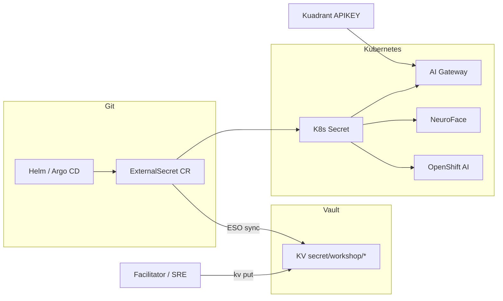

# HashiCorp Vault & External Secrets

**Git paths:** `charts/all/hashicorp-vault` (VP), `charts/all/vault-demo-auth/`, `charts/all/vault-maas-external-secrets/`, `charts/all/openshift-external-secrets/` (VP)
{: .fs-3 .text-grey-dk-000 }

Workshop AI demos (MaaS LLM, NeuroFace, Lightspeed, Kuadrant upstream auth) need **API keys that must never land in Git**. **HashiCorp Vault** on the hub is the central secrets store; **External Secrets Operator (ESO)** on hub and spokes syncs Vault paths into Kubernetes `Secret` objects that pods and gateways consume at runtime.

## What problem does it solve?

| Anti-pattern | Risk | Platform pattern |
| ------------ | ---- | ---------------- |
| `sk-*` keys in `values.yaml` or Helm templates | Leaked in Git history, forks, CI logs | Vault KV + facilitator-only init |
| Manual `oc create secret` per namespace | Drift, no rotation, not GitOps-friendly | `ExternalSecret` CR declares *what* to sync; Vault holds *values* |
| Shared MaaS Bearer in every deployment | One leak compromises all consumers | Upstream key in Vault; users get scoped Kuadrant **APIKEY** only |
| Copy-paste secrets across hub + spokes | Inconsistent versions, audit gaps | Hub Vault + ESO `ClusterSecretStore` (target state) |

Without Vault + ESO, facilitators rely on day-2 scripts (`scripts/apply-maas-secrets.sh`). That works for RHDP workshops but does not scale to production: no audit trail, no policy tiers, no automatic refresh when keys rotate.

## What ships on the hub

| Resource | Purpose |
| -------- | ------- |
| Vault StatefulSet | VP chart `hashicorp-vault` in namespace `vault` (Argo project `external-secrets`) |
| Route | `https://vault-vault.<hub-domain>/ui/` — use `/ui/` (route root returns HTTP 307) |
| `vault-demo-auth` | PostSync Job: enables `userpass`, policies, demo users `admin` / `user1` |
| `vault-maas-external-secrets` | **Pilot:** `ClusterSecretStore` + `ExternalSecret` for MaaS keys; Vault Kubernetes auth for ESO |
| `openshift-external-secrets` | VP chart wiring ESO to cluster (hub + spokes) |
| `workshop-api-vault-paths` ConfigMap | Documents KV paths for MaaS and Kuadrant keys (`charts/all/workshop-kuadrant-apis/`) |

Workshop users (`userN`) receive **view** RBAC on namespace `vault` via `platform-users`.

### Demo login (userpass)

| Vault user | Password (default) | Policy |
| ---------- | ------------------ | ------ |
| `admin` | `Welcome123!` | read/write `secret/workshop/*`, read `secret/global/*` |
| `user1` | `Welcome123!` | read `secret/workshop/*` |

Vault UI → **Sign in** → method **Username** (`userpass`).

Re-apply: `bash scripts/apply-vault-demo-auth.sh`

Facilitator init/unseal tokens live in local `values-secret.yaml` (gitignored) — never commit root tokens.

## Vault paths (workshop)

Documented in ConfigMap `workshop-api-vault-paths`:

| Path | Consumer | Purpose |
| ---- | -------- | ------- |
| `secret/workshop/maas` | AI Gateway upstream AuthPolicy | RHDP MaaS Bearer token (platform scope) |
| `secret/workshop/kuadrant/<user>/<api-product>` | Optional CI/CD mirror | Copy of Kuadrant consumer API keys |

Example (facilitator, after Vault is unsealed):

```bash
oc exec -n vault vault-0 -- vault kv put secret/workshop/maas api-key="<maas-token>"
```

Kuadrant keys created in Developer Hub remain Kubernetes Secrets (`kuadrant.io/api-key` label) in the user namespace; Vault mirroring is optional for pipelines that cannot call the Kuadrant API.

## Why ExternalSecret matters

An **`ExternalSecret`** is a Kubernetes CR that tells ESO:

1. **Which external store** to read (`SecretStore` / `ClusterSecretStore` → Vault auth)
2. **Which remote path** and property (`secret/data/workshop/maas` → `api-key`)
3. **Which K8s Secret** to create or update (`ai-maas-upstream-credentials`)

Benefits for this platform:

- **GitOps-safe** — commit the `ExternalSecret` manifest; secret *values* stay in Vault
- **Rotation** — update Vault KV; ESO refresh interval propagates to pods (restart or reload hooks)
- **Least privilege** — Vault policies per app path; workshop users never see upstream MaaS Bearer
- **Fleet consistency** — same pattern on hub (`ai-gateway-system`, `neuroface`, `developer-hub`) and spokes
- **Audit** — Vault logs who read/wrote which path; complements ACS image/runtime policies

### MaaS upstream (Vault + ESO pilot)

Chart `charts/all/vault-maas-external-secrets/` (hub Argo app, sync wave 4) ships:

| Resource | Purpose |
| -------- | ------- |
| PostSync Job `vault-k8s-auth-eso` | Enables Vault `kubernetes` auth + policy `external-secrets-maas-read` for SA `external-secrets-vault` |
| `ClusterSecretStore` `vault-workshop-maas` | ESO → Vault KV `secret/workshop/maas` |
| `ExternalSecret` (×5) | Syncs to `ai-gateway-system`, `kairos-system`, `maas-workshop`, `neuroface`, `developer-hub` |
| CronJob `maas-authpolicy-sync` | Patches Kuadrant `AuthPolicy` `ai-maas-auth` Bearer header from ESO secret |
| CronJob `maas-secret-rollout-sync` | Restarts NeuroFace / Developer Hub when ESO refresh time changes |

Facilitator flow (keys never in Git):

```bash
export MAAS_KEY_LLAMA='sk-...'
bash scripts/apply-maas-secrets.sh   # auto-detects ClusterSecretStore; seeds Vault + triggers ESO
# or explicitly:
bash scripts/seed-maas-vault.sh
```

Set `USE_VAULT_ESO=0` to fall back to direct `oc create secret` (legacy workshops).

Do **not** set `maasApiKey` in Helm when using ESO — upstream Bearer comes from Vault via `ExternalSecret` + AuthPolicy sync.

### Target pattern (reference YAML)

```yaml
apiVersion: external-secrets.io/v1beta1
kind: ExternalSecret
metadata:
  name: ai-maas-upstream
  namespace: ai-gateway-system
spec:
  refreshInterval: 1h
  secretStoreRef:
    name: vault-workshop
    kind: ClusterSecretStore
  target:
    name: ai-maas-upstream-credentials
    creationPolicy: Owner
  data:
    - secretKey: api-key
      remoteRef:
        key: secret/data/workshop/maas
        property: api-key
```

Downstream workloads (NeuroFace backend, OpenShift AI `maas-workshop`, Lightspeed `llama-stack-secrets`) follow the same model with namespace-scoped `ExternalSecret` resources pointing at path-specific keys.

### Without ExternalSecret (workshop day-2)

Facilitators inject keys after hub sync — keys are never printed or committed:

```bash
export MAAS_KEY_LLAMA='sk-...'
bash scripts/apply-maas-secrets.sh
```

This creates/patches Secrets in `ai-gateway-system`, `neuroface`, `maas-workshop`, `developer-hub`, etc. Use for RHDP labs when Vault/ESO is not yet wired; migrate to `ExternalSecret` for repeatable GitOps.

## Secret flow (hub AI stack)



Workshop users hold **Kuadrant APIKEY** credentials only. The gateway injects the **MaaS Bearer** from the synced Secret — users never see the upstream token.

## Operator discovery

| Component | Where it surfaces |
| --------- | ----------------- |
| Vault | Console **Platform Hub-Spoke** → **Vault**; namespace `vault` |
| ESO | Operator in `external-secrets-operator`; config chart `openshift-external-secrets` |
| Paths doc | `oc get cm workshop-api-vault-paths -n workshop-kuadrant-apis -o yaml` |
| Demo users | `oc get cm vault-demo-login -n vault` |

Argo CD AppProject: **`external-secrets`** (Vault, ESO, `vault-demo-auth`).

## Verify

```bash
# Vault UI (expect 200 on /ui/)
curl -sk -o /dev/null -w '%{http_code}\n' "https://vault-vault.$(oc get ingresses.config/cluster -o jsonpath='{.spec.domain}')/ui/"

oc get pods -n vault
oc get pods -n external-secrets-operator
oc get externalsecret -A   # after ClusterSecretStore + ExternalSecrets are applied

# Workshop paths reference
oc get cm workshop-api-vault-paths -n workshop-kuadrant-apis
```

## Troubleshooting

| Symptom | Fix |
| ------- | --- |
| Vault link HTTP 307 | Use `/ui/` in ConsoleLink href |
| `userpass` login fails | Re-run `bash scripts/apply-vault-demo-auth.sh` |
| NeuroFace chat 401 | Confirm `neuroface-maas-api-key` or run `apply-maas-secrets.sh` |
| ExternalSecret `SecretSyncedError` | Check Vault policy, `ClusterSecretStore` auth, path spelling |
| Keys in Git | Remove from history; rotate keys; use Vault + ESO only |

## Documentation

- [Install playbook — Vault](../install-improvements.md#hashicorp-vault-hub)
- [Workshop module — Vault & External Secrets](../workshop/index.md)
- [External Secrets Operator for OpenShift](https://docs.redhat.com/en/documentation/openshift_container_platform/4.17/html/security_and_compliance/external-secrets-operator-for-red-hat-openshift)
- [HashiCorp Vault](https://developer.hashicorp.com/vault/docs)

**Related:** [Developer Hub](developer-hub.md) (Kuadrant keys) · [NeuroFace](neuroface.md) (MaaS consumer) · [ACS](acs.md) (runtime security complement)
